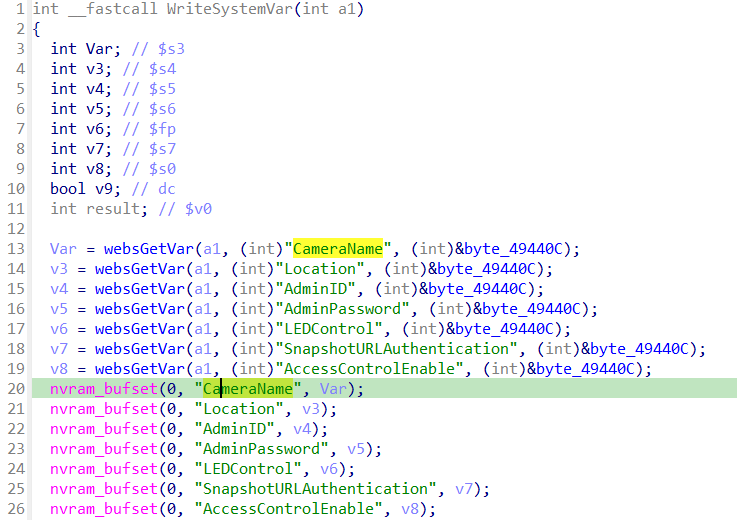
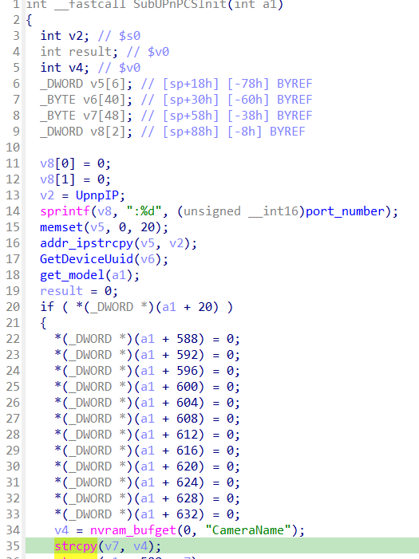

# D-link DCS-932L buffer overflow vulnerability in udev

## Overview
- Vulnarable product: D-link DCS-932L
- Manufacturer's website information: https://www.dlink.com/
- Firmware download address: [https://legacyfiles.us.dlink.com/DCS-932L/REVB/FIRMWARE/DCS-932L_REVB_FIRMWARE_2.18.01.zip](https://legacyfiles.us.dlink.com/DCS-932L/REVB/FIRMWARE/DCS-932L_REVB_FIRMWARE_2.18.01.zip)

## Affected version
Firmware version 2.18.01（latest version）

## Vulnerability Details

This vulnerability is a cross-binary vulnerability. 

First, the `CameraName` parameter is obtained from the `WriteSystemVar` function of `/bin/alphapd` (this function can be triggered by routes such as `setSystemWizard`), and then it is set to the value of `CameraName` in `nvram`.

Then, in `/sbin/udev` 's `SubUPnPCSInit` function, get the value of `CameraName` from `nvram` and copy it to the stack variable by calling `strcpy`, causing a stack overflow.

## CVE

CVE-2025-4843