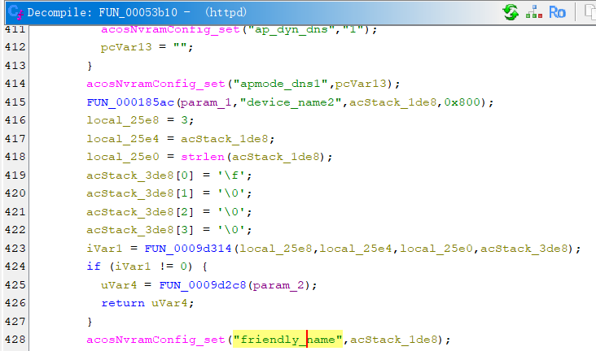
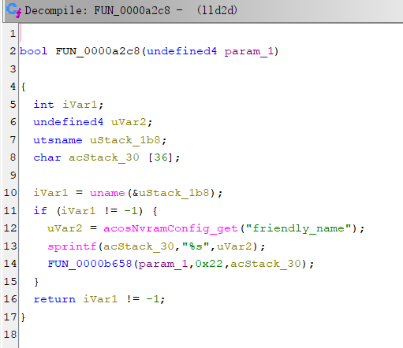

## Overview

- Manufacturer's website: https://www.netgear.com
- Firmware download website:
  - https://www.netgear.com/support/product/r7100lg/#download

## Affected version

Netgear R7100LG [V1.0.0.78](https://www.downloads.netgear.com/files/GDC/R7100LG/R7100LG_V1.0.0.78_1.0.6.zip)(latest version)

## Vulnerability details

An attacker can send a request to `wlg_adv.cgi`, and the `httpd` program sets the `device_name2` parameter to a string with a maximum length of 0x800. After escaping some characters (to prevent command injection), the string is set as the friendly_name parameter of nvram.

In the `lld2d` program, the value of `friendly_name` is obtained from nvram and copied to the stack variable `acStack_30` through `sprintf`, but its length is only 36, thus causing a stack overflow.

## CVE

not yet