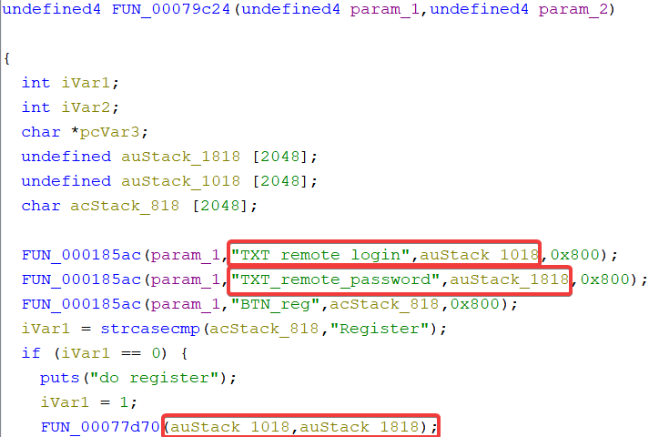
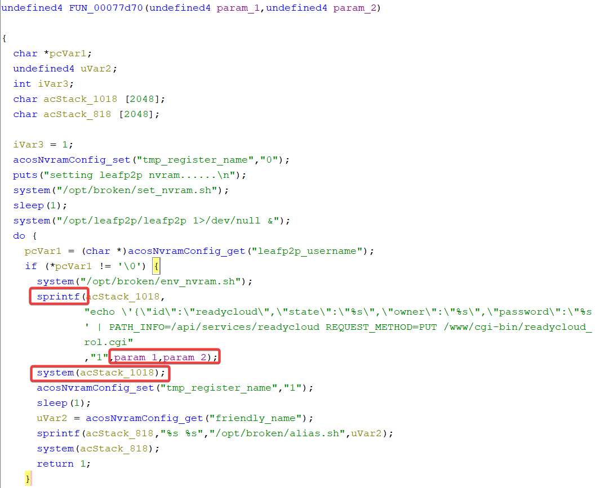

## Overview

- Manufacturer's website: https://www.netgear.com
- Firmware download website:
  - https://www.netgear.com/support/product/r7100lg/#download

## Affected version

Netgear R7100LG [V1.0.0.78](https://www.downloads.netgear.com/files/GDC/R7100LG/R7100LG_V1.0.0.78_1.0.6.zip)(latest version)

## Vulnerability details

A command injection vulnerability exists in the `FUN_00079C24` function of bianry `httpd`, which handles `user_setup.cgi`.

The function receives the `TXT_remote_login` , `BTN_reg` and `TXT_remote_password` parameters from the user's request. When `BTN_reg` is `Register` , the `FUN_00077d70` function is called with `TXT_remote_login` and `TXT_remote_password` as its two parameters.

The `FUN_00077d70` function calls `sprintf` to splice these two arguments into the string `acStack_1018` and then calls `system` to execute it, with no filtering in between and causing a command injection.

## CVE

not yet