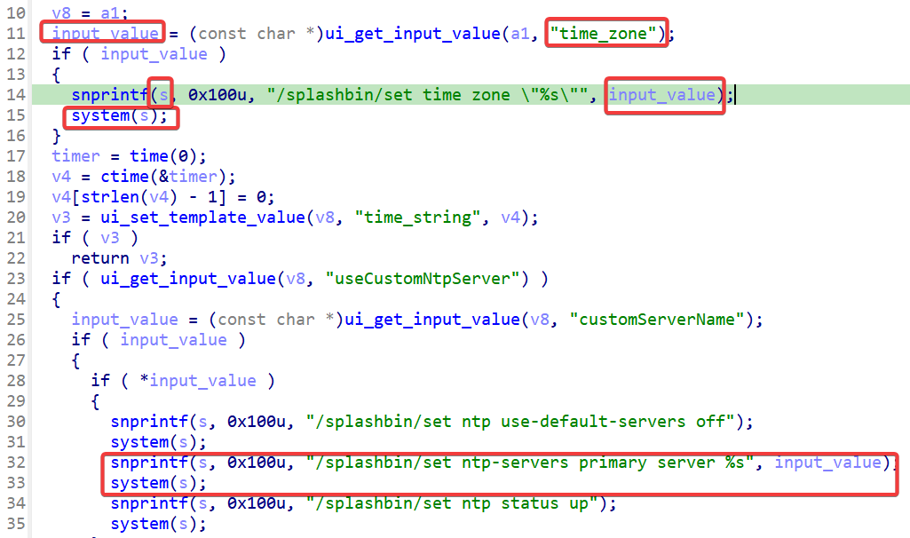

## Overview

+ Vendor: https://www.netgear.com/

+ Product: [WG302v2](https://www.netgear.com/support/product/wg302v2#download), [WAG302v2](https://www.netgear.com/support/product/wag302v2#download)
+ Firmware download:
  + [WG302v2 5.2.9](https://www.downloads.netgear.com/files/GDC/WG302V2/WG302v2 Firmware Version 5.2.9.zip)
  + [WAG302v2 5.1.19](https://www.downloads.netgear.com/files/GDC/WAG302V2/WAG302v2 Firmware Version 5.1.19 (North America).zip)

## Affected version

WG302v2 5.2.9 & WG302v2 5.2.9 (other versions might be vulnerable)

## Vulnerability details

In the WG302v2 5.2.9 & WG302v2 5.2.9 has a command injection vulnerability located in the `ntp_handler` function of file `ngadmin`. This function accepts the `time_zone` parameter, `customServerName` parameter and other parameters from a POST request. Both parameters may be spliced into the variable `s`, which is then passed to the system for execution.

## CVE

not yet
