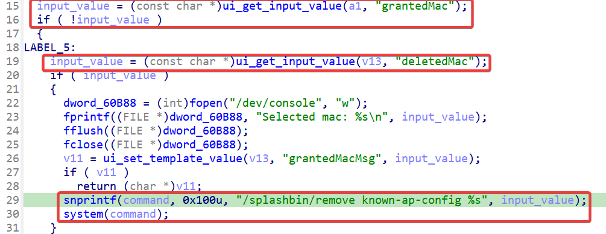
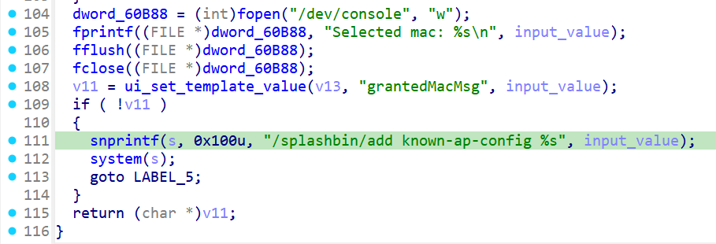

## Overview

+ Vendor: https://www.netgear.com/

+ Product: [WG302v2](https://www.netgear.com/support/product/wg302v2#download), [WAG302v2](https://www.netgear.com/support/product/wag302v2#download)
+ Firmware download:
  + [WG302v2 5.2.9](https://www.downloads.netgear.com/files/GDC/WG302V2/WG302v2%20Firmware%20Version%205.2.9.zip)
  + [WAG302v2 5.1.19](https://www.downloads.netgear.com/files/GDC/WAG302V2/WAG302v2%20Firmware%20Version%205.1.19%20(North%20America).zip)

## Affected version

WG302v2 5.2.9 & WG302v2 5.2.9 (other versions might be vulnerable)

## Vulnerability details

In the WG302v2 5.2.9 & WG302v2 5.2.9 has a command injection vulnerability located in the `rogueap_handler` function of file `ngadmin`. This function accepts the `deletedMac` parameter, `grantedMac` parameter and other parameters from a POST request. Both parameters may be spliced into the variable `command` or `s`, which is then passed to the system for execution.

When `grantedMac` is empty and `deletedMac` is not, if `ui_set_template_value(v13, "grantedMacMsg", input_value)` returns 0, which means success, the `deletedMac` parameter will be spliced into the variable `command`, which is then passed to the system for execution.

When `grantedMac` is not empty, if `ui_set_template_value(v13, "grantedMacMsg", input_value)` returns 0, which means success, the `grantedMac` parameter will be spliced into the variable `s`, which is then passed to the system for execution.

## CVE

not yet
